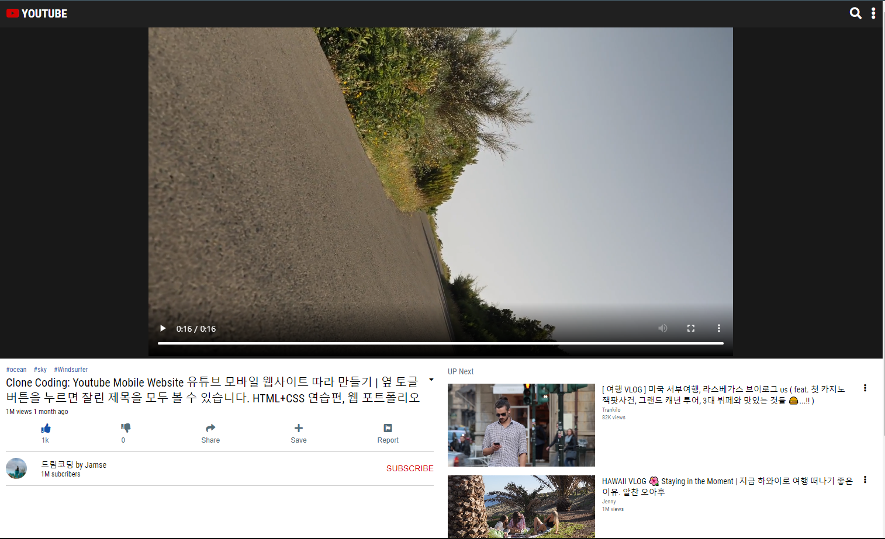
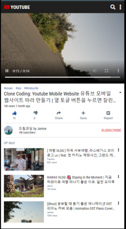

# YouTube Web

### Project

- 개요 : 유튜브 모바일 웹사이트를 Responsive Web으로 따라 만들기
- 언어 : HTML, CSS, JavaScript
- 기간 : 21.07.26 ~ 21.07.28

### 주요 기능

1. Responsive Web

### YouTube Web [Click here](https://won-jin-lee.github.io/YouTube-Web)

## Wide Screen

## Small Screen

